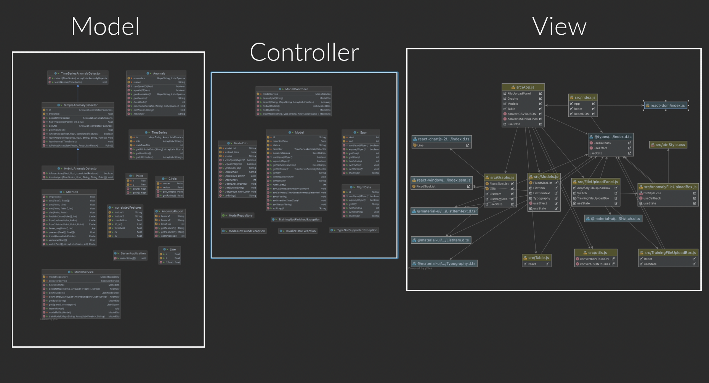

# Anomaly Detector Web Application
About the application
---------------------
This is an anomaly detection web application. It contains two parts:  
***The anomaly detection server***, which is responsible on training models and saving them on the database, and detect anomaly with these models.  
***The anomaly detection web application***, which is responsible on connecting between the client and the server.    

About the project structure
---------------------------
The project implements the **MVC architectural pattern**.
The responsility of the **Model** is to analyze and train the given models, store them on the database, and detect anomaly with them.  
The **View** is responsibe on showing the models and the anomaly detection to the user in an interactive way - data like the graphs and the anomaly. The View is also responsible on interacting between the user and the server.  
The **Controller** is responsible on connecting between the **Model** and the **View**, in such way that the model and the view don't know each other. The **View** sends data to the **Controller**, which makes the **Model** to work on that data and when the **Model** finishes, sending the result to the view.  
  
About the directories of the server:  
***Service directory*** which contains the class that are related to the **Model** of the **MVC**. The main service classes are *ConcreteModelService*, which is the service for interacting with the database,
*ConcreteModelTrainingService*, which is the service for training the models, and *ConcreteAnomalyDetectionService*, which is the service for anomaly detection.  
Those classes implement interfaces accordingly.  

Required installations
----------------------
The application is written in using the Java Spring Framework, MongoDB database and reactJS.

To run the application you should have the following:  
**Java**:
https://www.java.com/en/download/

**Mongodb**:
https://www.mongodb.com/try/download/community

**Maven**:
Linux:
```
sudo apt-get install maven
```
Windows and Mac:
https://maven.apache.org/download.cgi

**NodeJS and npm**:
Linux:
```
sudo apt-get install npm && sudo apt-get install nodejs
```
Windows and Mac:
https://nodejs.org/en/download/

Installation and Running instructions
-------------------------------------
There are **many ways** to run the application. The easiest is to run it from **Visual Studio**, but it is important to know that there are **other options**, like compiling  
the code manualy and run in a *.NETCORE 3.0* environment. Notice that the *OxyPlot* plugin is requird to run the applicaiton.  
  
*How to run the application in Visual Studio ?*  
**First**, install the Visual Studio and **clone this repository**.  
**Second**, install the *OxyPlot* plugin. In Visual Studio: **Project -> Manage NuGet Packages -> Browse -> Search "OxyPlot Wpf" -> Install OxyPlot.Wpf**  
**Then**, run the application by pressing the green run button in the Visual Studio. The *Opening window* will be opened, and the instructions will be showed there. Then open the *FlightGear* application and do the instructions which are showed in our application.  

About the plugin
----------------
The application supports inserting anomaly detection algorithm plugin dynamically. In the *Plugins* directory, there are two anomaly detection algorithm plugins that you can insert to the application. Those plugins are written in C++.  

**To use your own plugin**, your plugin should contain a function with the signature:  
**g(StringBuilder str, int len, string normalDataFilePath, string anomalyDataFilePath)**  
***str*** - a string builder that will finally hold the string that represents the anomaly. This string format will be as following:  
Every line of the string will be in the pattern:  
*FrameNumber:FirstAnomalyProperty1-SecondAnomalyProperty1,FirstAnomalyProperty2-SecondAnomalyProperty2,...,*  
where *FirstAnomalyProperty* and *SecondAnomalyProperty* are the indices of the corelative anomaly properties.  
***len*** - the length of the string that the parameter ***str*** represents.  
***normalDataFilePath*** - the path to the .csv file with the normal flight data.  
***anomalyDataFilePath*** - the path to the .csv file with the anomaly flight data.  

**Note** that the anomaly detection algorithm plugin can be written in every language that can implement the function with the signature above, like C++, C#, and Java, but we tested the application only with plugins that were written in C++.  

Demonstration Video
----------------
https://youtu.be/2U8jjl2nS5c

Uml Diagram
----------------
  
  


